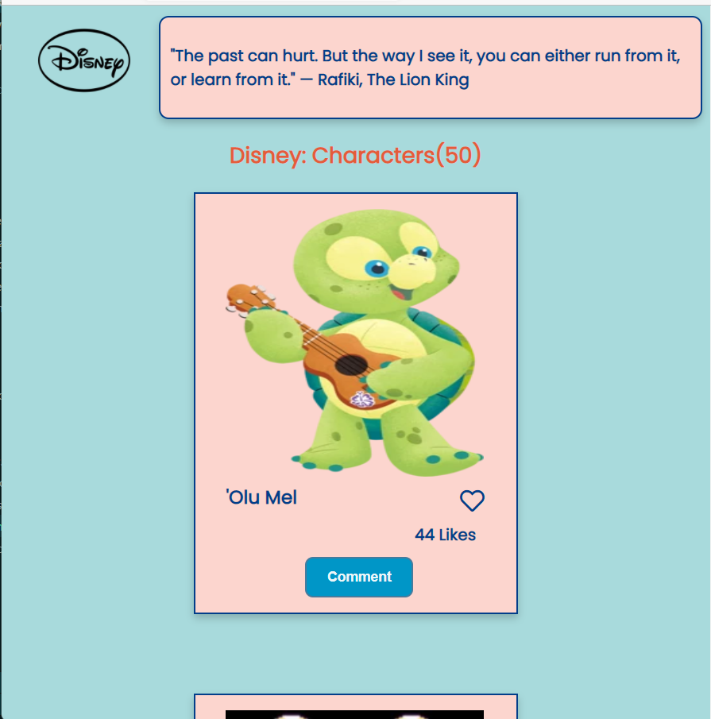
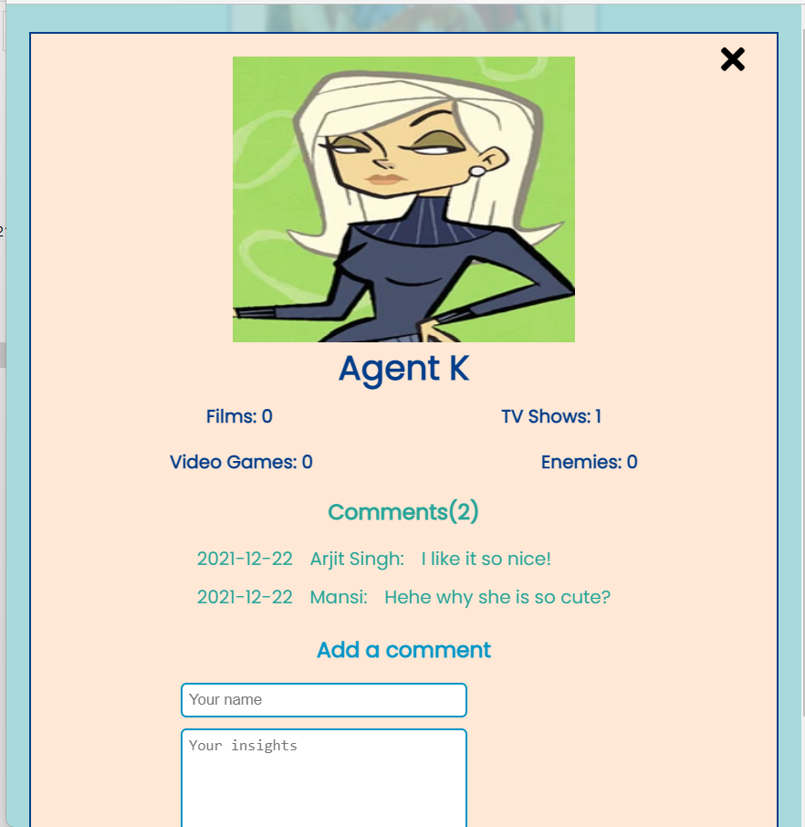
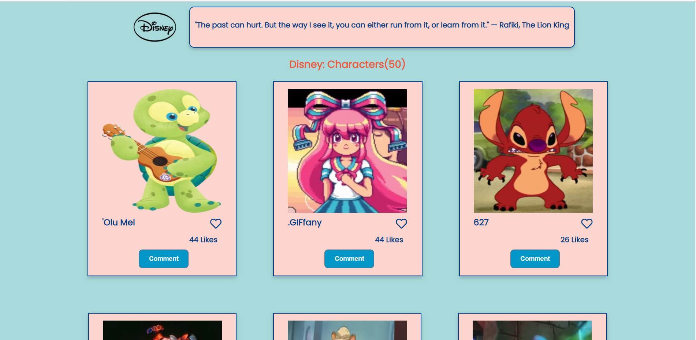
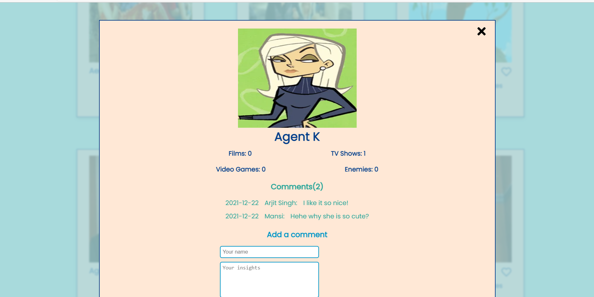

# Disney Characters

> Disney Character is a web applications that shows data of Disney characters from the Disney API. User can like the character and users can also leave comment to any character on comment popup. It shows the comments left by other people and gives idea what people think about Disney characters.

## Screenshots:

### mobile

### desktop

Project's features are added into seperate branch to keep main branch safe.

## Built With

- HTML
- CSS
- JavaScript
- Webpack
- APIs

## Online live link

[Visit project online](https://thecodechaser.github.io/Disney-characters-webapp/dist/)

## Getting Started

To get a local copy up and running follow these simple example steps.

### Prerequisites
- A text editor(preferably Visual Studio Code)

### Install
- [Git](https://git-scm.com/downloads)
- [Node](https://nodejs.org/en/download/)

### Using it Locally
- Clone the project from GitHub [here](git@github.com:thecodechaser/Disney-characters-webapp.git)
- Run the following commands as listed in your terminal:
- `npm install`
- `npm run start # this will make webpack watching for your changes in code`
- `npm start #This is to run the tests on the count method`

## Visit And Open Files

[Visit Repo](https://github.com/thecodechaser/Disney-characters-webapp)

## Download Repo

[Download Repo](https://github.com/thecodechaser/Disney-characters-webapp/archive/refs/heads/dev.zip)

## Authors

👤 **Ranjeet Singh**

- GitHub: [@githubhandle](https://github.com/thecodechaser)
- Twitter: [@twitterhandle](https://twitter.com/thecodechaser)
- LinkedIn: [LinkedIn](https://linkedin.com/in/thecodechaser)

👤 **Roshan Bajgain**

- GitHub: [@roshan-bajgain](https://github.com/roshan-bajgain)
- Twitter: [@RoshanBajgain10](https://twitter.com/RoshanBajgain10)
- LinkedIn: [LinkedIn](https://www.linkedin.com/in/roshan-bazgain/)

## 🤝 Contributing

Contributions, issues, and feature requests are welcome!

Feel free to check the [issues page](https://github.com/thecodechaser/Disney-characters-webapp/issues).

## Show your support

Give a ⭐️ if you like this project!

## Acknowledgments

- Inspiration: Microverse

## 📝 License

This project is [MIT](./MIT.md) licensed.
